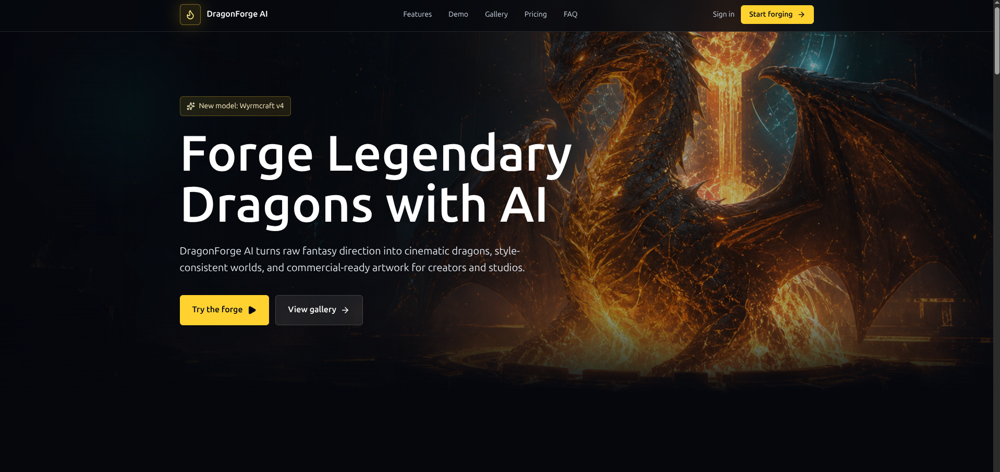
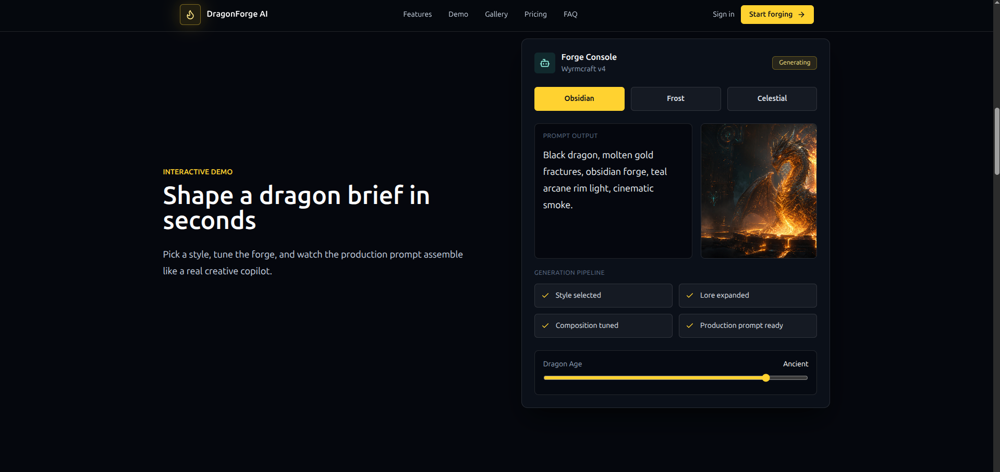
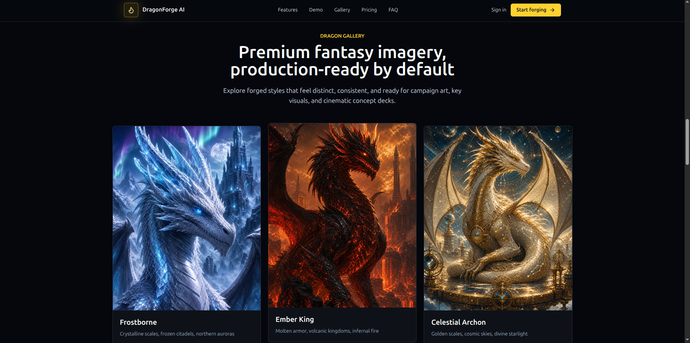

# DragonForge AI

A premium fantasy-themed AI SaaS landing page built with React and Vite.

DragonForge AI explores how a specialized AI platform for fantasy content creation could be presented through cinematic visuals, interactive product demonstrations, premium branding, and modern SaaS design principles.

---

## 🚀 Live Demo

**Website:** https://dragonforge-ai.vercel.app

---

# Project Preview

## Hero Section



## Interactive Forge Console



## Dragon Gallery



---

# Overview

DragonForge AI is a concept landing page designed for creators, worldbuilders, game studios, and digital artists.

The project combines fantasy-inspired storytelling with modern SaaS design principles to showcase how an AI-powered dragon generation platform could be marketed through an immersive and visually engaging user experience.

The design focuses on:

* Premium fantasy branding
* Interactive product storytelling
* Modern SaaS UI patterns
* Responsive layouts
* High-impact visual presentation

---

# Features

## Mythic Prompt Engine

Transform rough fantasy concepts into production-ready creative prompts.

## Style Memory System

Maintain visual consistency across creatures, worlds, and campaign assets.

## Commercial Guardrails

Designed around professional workflows, approvals, and commercial usage requirements.

## Interactive Forge Console

Experiment with multiple dragon archetypes:

* Obsidian Dragon
* Frost Dragon
* Celestial Dragon

Each selection dynamically updates artwork, prompts, and visual presentation.

## Dragon Gallery

A curated showcase of fantasy creature concepts designed to demonstrate visual consistency and production-ready art direction.

## SaaS Pricing Section

Professional pricing structure designed for:

* Independent creators
* Creative studios
* Enterprise publishers

## FAQ Section

Provides quick answers for potential customers evaluating the platform.

## Responsive Design

Optimized for:

* Desktop
* Tablet
* Mobile

---

# Tech Stack

* React
* Vite
* JavaScript (ES6+)
* CSS3

---

# Design Objectives

This project was created to explore:

* Premium AI product experiences
* Fantasy-focused branding systems
* Modern SaaS landing page architecture
* Interactive product demonstrations
* Responsive frontend development

---

# Performance Focus

* Fast loading experience
* Responsive layouts
* Smooth animations
* Lightweight architecture
* Optimized asset delivery

---

# Installation

```bash
git clone https://github.com/ArpDarkDesign/dragonforge-ai.git

cd dragonforge-ai

npm install

npm run dev
```

# Production Build

```bash
npm run build
```

---

# Future Enhancements

* User authentication
* AI-powered dragon generation workflows
* Saved dragon collections
* Theme customization
* Worldbuilding tools
* Backend integration
* User dashboards

---

# Repository Structure

```text
dragonforge-ai/
│
├── public/
├── screenshots/
│   ├── hero.png
│   ├── obsidian.png
│   └── gallery.png
│
├── src/
├── package.json
├── vite.config.js
└── README.md
```

---

# Author

**ArpDarkDesign**

GitHub: https://github.com/ArpDarkDesign

Portfolio Projects:

* DragonForge AI
* Neon Journal

---

# License

This project is available for educational, portfolio, and demonstration purposes.

---

⭐ If you enjoyed this project, consider starring the repository.
